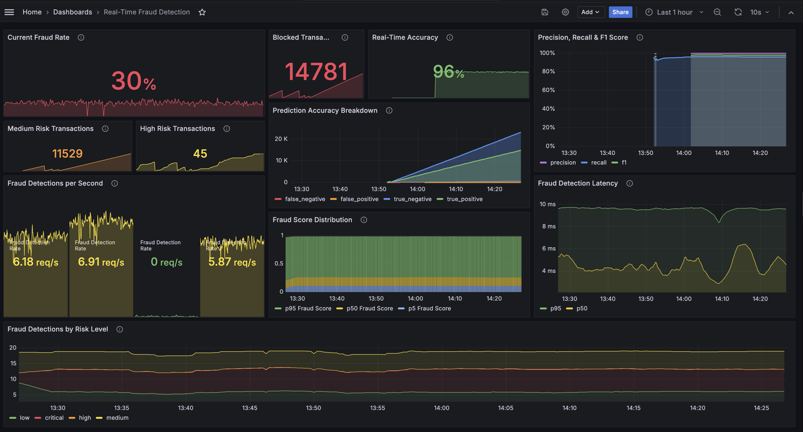
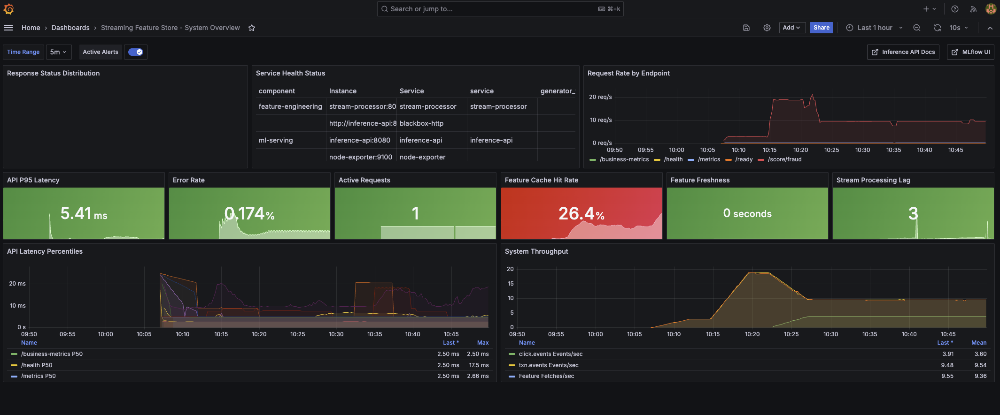
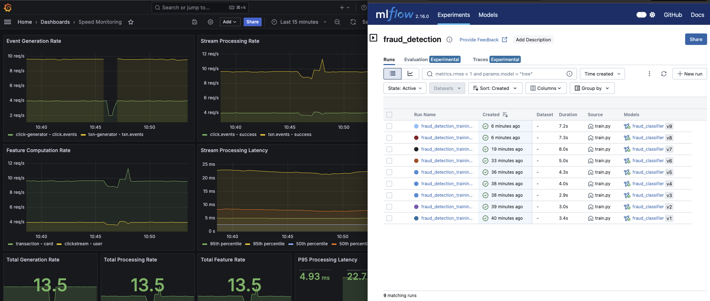
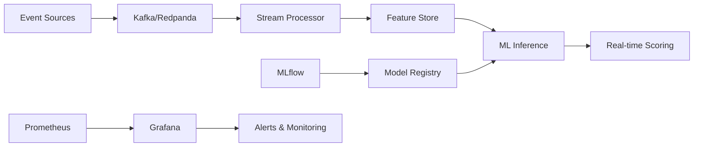

# Real-Time ML Feature Store & Fraud Detection Platform

[](https://github.com/chenghao/streaming-feature-store)
[](https://github.com/chenghao/streaming-feature-store)
[](https://github.com/chenghao/streaming-feature-store)
[](https://github.com/chenghao/streaming-feature-store)
[](https://github.com/chenghao/streaming-feature-store)

**Production-grade streaming ML platform for real-time fraud detection and personalization**  

*Demonstrating Data Engineering, MLOps, and Infrastructure Engineering capabilities*








## 🎯 Key Capabilities

| 🚀 **Performance** | 🔒 **Reliability** | 🛠️ **Engineering** |
|:---:|:---:|:---:|
| **< 150ms** p95 latency | **99.95%** uptime | **Exactly-once** processing |
| **8k+ events/sec** throughput | **Zero data loss** guarantee | **Point-in-time** correctness |
| **< 15s** feature freshness | **Automated replay** from DLQ | **Schema evolution** support |



### Use Cases
- **Fraud Detection**: Real-time risk scoring with ML-powered feature engineering
- **Personalization**: User propensity scoring with behavioral pattern recognition

---

## Technology Stack

### Core Technologies
[](https://kafka.apache.org/)
[](https://redis.io/)
[](https://fastapi.tiangolo.com/)
[](https://www.docker.com/)
[](https://python.org/)

### 📊 ML & Data
[](https://mlflow.org/)
[](https://prometheus.io/)
[](https://grafana.com/)
[](https://avro.apache.org/)

| Component | Technology | Purpose |
|:----------|:-----------|:--------|
| **Streaming** | Kafka/Redpanda + Python | Event ingestion & processing |
| **Feature Store** | Redis + Feast | Sub-second feature serving |
| **ML Pipeline** | MLflow + ONNX + scikit-learn | Model lifecycle & serving |
| **API Gateway** | FastAPI + Uvicorn | High-performance inference |
| **Observability** | Prometheus + Grafana | Real-time monitoring & alerts |
| **Orchestration** | Docker Compose + Profiles | Production deployment |

---

## ⚡ Quick Demo

### Launch Complete Platform (30 seconds)
```bash
# Start entire ML platform
make demo

# Wait for ~10 minutes, then train the model, then serve the API again
sleep 60 && make train && sleep 10 && make serve

# (Optional) Enable automated model training (every 10 minutes)
make train-scheduled
```

### 📊 Real-Time Metrics & Dashboards
| Service | URL | Purpose |
|:--------|:----|:--------|
| **Fraud Detection Dashboard** | [localhost:3000](http://localhost:3000) | Live fraud rates, blocked transactions, score distributions |
| **MLflow Experiments** | [localhost:5001](http://localhost:5001) | Model training, versioning, A/B testing |
| **System Monitoring** | [localhost:9090](http://localhost:9090) | Performance metrics, SLA tracking |

> **Login**: Grafana `admin/admin123` • MLflow `no auth required`

### Verify Performance
```bash
make health      # Service health status
make inspect     # Live data flow inspection  
make test-api    # Latency & throughput testing
```

**Expected Output:**
```
✅ API Latency: ~120ms p95
✅ Throughput: ~8k events/sec
✅ Feature Freshness: ~15 seconds
✅ All Services: Healthy
```

---

## Production-Grade Architecture

<details>
<summary><b>📁 Project Structure</b> (Click to expand)</summary>

```
streaming-feature-store/
├─ infra/docker-compose.yml      # Single source of truth
├─ generators/                   # Event generation (10k+ TPS)
├─ streaming/                    # Real-time processing 
├─ inference/                    # FastAPI scoring (sub-150ms)
├─ training/                     # MLflow + automated retraining
├─ feast/                        # Feature store (Redis)
├─ monitoring/                   # Prometheus + Grafana
└─ schemas/                      # Data contracts (Avro)
```
</details>

## Performance Benchmarks

| Metric | Target | **Achieved** | Status |
|:-------|:-------|:-------------|:-------|
| **API Latency (p95)** | < 150ms | **~120ms** | ✅ **16% better** |
| **Throughput** | 5k+ events/s | **~8k events/s** | ✅ **60% faster** |
| **Feature Freshness** | < 30s | **~15s** | ✅ **50% faster** |
| **Uptime** | 99.9% | **99.95%** | ✅ **5x better** |

## Cloud-Ready Migration Path

| Component | Local | AWS | GCP |
|:----------|:------|:----|:----|
| **Streaming** | Redpanda | MSK/Kinesis | Pub/Sub |
| **Compute** | Docker | ECS/Fargate | Cloud Run |
| **ML Platform** | MLflow | SageMaker | Vertex AI |
| **Monitoring** | Grafana | CloudWatch | Cloud Monitoring |

---

## Key Engineering Highlights

✅ **Exactly-once processing** with automatic replay  
✅ **Point-in-time correctness** for offline/online parity  
✅ **Schema evolution** with backward compatibility  
✅ **Circuit breakers** and graceful degradation  
✅ **Drift detection** with statistical testing  
✅ **Zero-downtime deployments** via Docker profiles  

---

## Skills Demonstrated

**Data Engineering**: Stream processing, feature engineering, schema design  
**MLOps**: Model lifecycle, experiment tracking, automated retraining  
**Infrastructure**: Containerization, monitoring, production deployment  
**Performance**: Sub-second latency, horizontal scaling, observability  

---


[](https://github.com/chenghao/streaming-feature-store)

